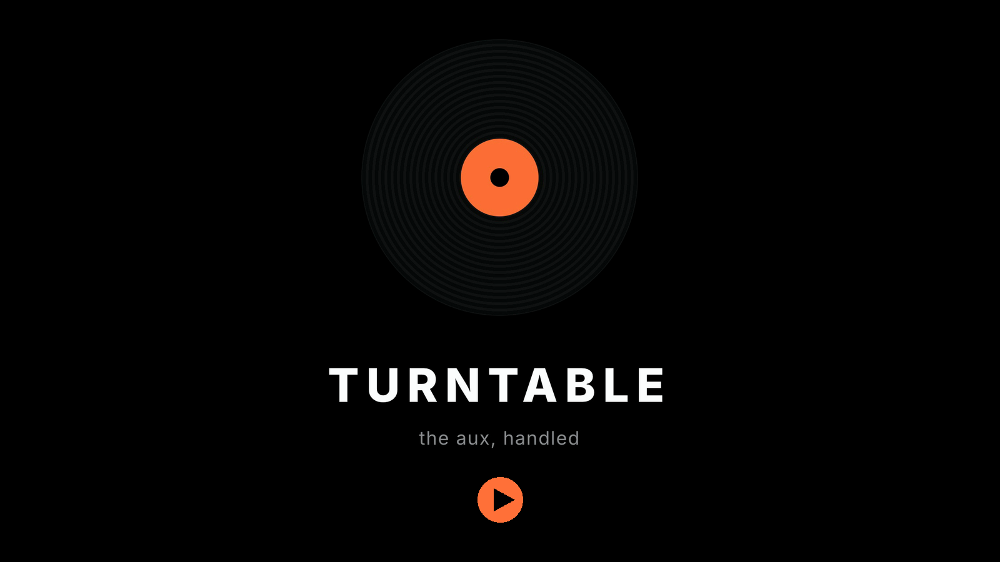

# Turntable

An iPhone app your coding agent can DJ.

You text your agent. The music changes.

<a href="docs/turntable-promo.mp4"></a>

<sub><b>27 second promo.</b> Click the still to play it here on GitHub, or grab
<a href="docs/turntable-promo.mp4">docs/turntable-promo.mp4</a> directly.</sub>

Turntable is two pieces: an iOS app that plays Apple Music, and a small Python server your
agent writes to. The agent never touches Apple Music. It sets a pick on the server, the
phone checks in every 15 seconds, reads the pick, and plays it.

```
  you  ->  your agent  ->  server  <-  phone  ->  Apple Music
         "play something     the pick    checks in every 15s
          quieter"                       and follows it
```

That is the whole idea. The agent already knows what you are doing, what you asked for
last time, and what time it is. This gives it a speaker.

## Quickstart

You need: an iPhone with an Apple Music subscription, a Mac with Xcode to install the app
once, and an agent that can run shell commands somewhere.

**1. Build and install the app.** See "Building the app" below. It ships pointing at
nothing.

**2. Open it and tap Copy Prompt.** The first screen is the whole of setup: a prompt to
copy, and one box for the code that comes back.

**3. Paste that prompt to your agent.** Any agent with a shell. It does this:

```
curl -fsSL https://raw.githubusercontent.com/abhaymettu/turntable/main/server/server.py -o server.py
nohup python3 server.py > turntable.log 2>&1 &
python3 server.py --pair
```

Python 3, standard library only, nothing to install, no code to edit.

**4. Enter the code.** One code, one box, whatever kind of agent you asked. There is never
an address to type.

**5. Ask for a song.** Your agent already has [AGENTS.md](AGENTS.md).

### The one decision your agent makes

Where the server runs decides what the code looks like, and the agent works that out from
where its own shell is:

| Your agent's shell | What it does | What it sends you |
| --- | --- | --- |
| On your Wi-Fi (your laptop, a local coding agent) | Starts the server plain. It announces itself as `_turntable._tcp` and the phone finds it. | Six characters, e.g. `DPGTX9` |
| Anywhere else (a cloud or hosted agent) | Starts the server with `TURNTABLE_PUBLIC_URL` set to an address your phone can already reach. | One longer code starting `TT1-`, which carries that address inside it |

The long code is `TT1-` plus base64url of the address and a single-use secret. It carries
no token, the secret dies in 15 minutes and works once, and the server refuses to put a
public plain-`http` address in one. The app decodes it, checks the address, and redeems
straight against it, so nothing has to be discovered.

A cloud agent needs an address that already exists: a public hostname, a tunnel that is
already running, or a tailnet address **your phone is also on**. If it has none, the right
answer is to run those three commands on your own computer instead, and the prompt tells it
to say so rather than improvise.

Either way, the address your phone keeps afterwards is the one the server names in its
pairing reply, not the one in the code.

## For agents

[AGENTS.md](AGENTS.md) is the file to hand a coding agent. It covers the one command
server setup, minting a pairing code, every endpoint with a curl example, how to tell
whether the phone is actually listening, and the etiquette of steering someone's music.

## What is in the app

- **DJ.** Search the Apple Music catalog, tap to queue, drag to reorder, swipe to remove.
  A Now Playing bar with a record that turns while music plays. A status line that says
  whether the agent link is up, and when it is not, why.
- **Video.** Paste a YouTube link and it plays in an embedded player. No API key.
- **Podcasts.** Paste an RSS feed and it parses and plays episodes. No API key.
- **Audio route.** The current output (AirPods, speaker, car) is read and shown.

Every gate has a real screen rather than a spinner: no permission yet, permission denied,
no subscription, empty queue, search failed, no results, agent offline with the reason.

## Connectivity

Pairing on the six character path needs both on the same Wi-Fi; the `TT1-` path needs only
an address the phone can reach. After that, the phone has to go on reaching the server, and
if you want that off your home Wi-Fi there are three ways, with their costs. Set
`TURNTABLE_PUBLIC_URL` to the address before pairing; a phone that already paired keeps
whatever it was told then.

- **Tailscale.** Both on the tailnet, use the server's `100.x` address. Nothing is exposed
  publicly. Needs the Tailscale app running on the phone: a `100.x` address the phone has
  not joined is unreachable, not private.
- **A tunnel** (cloudflared, ngrok). Gives a laptop behind NAT a public https URL. Set
  `TURNTABLE_PUBLIC_URL` to the tunnel URL so a pairing phone is told the right address.
  Free tunnel URLs change on restart, and the phone then has a stale address.
- **A public host.** Stable, works on cell data, and the server is on the open internet
  with only a bearer token in front of it. Put it behind TLS before doing this.

## Design decisions

- **One user per server.** No accounts, no multi-tenancy. One person's picks and devices
  per server process. Run your own.
- **The token is the whole security model.** Every endpoint except `GET /healthz` and
  `POST /pair` needs `Authorization: Bearer <token>`. The phone's token comes from
  pairing; the agent's own token is generated on first start and written to
  `server/auth.json` (mode 0600, gitignored). Pairing codes are stored hashed with a 15
  minute expiry and burn after ten wrong guesses.
- **A pairing code carries a secret, never a token.** The `TT1-` code holds an address and
  a single-use 16 character secret, which is about 78 bits and is stored server-side only
  as a sha256. Both sides refuse a public plain-`http` address, because that secret and the
  token that comes back would cross the internet readable.
- **The app says why.** A failed steer comes back to the server in the next check-in as
  `last_steer_error`, so the agent can report the real reason instead of guessing.
- **Colour never carries meaning alone.** Every status dot sits next to a word.

## Building the app

Needs Xcode 26 with an iOS 26 simulator or a registered device. The project file is
committed, so a clean checkout builds without xcodegen.

```
xcodebuild -scheme Turntable \
  -destination 'platform=iOS Simulator,name=iPhone 17 Pro' \
  -configuration Debug CODE_SIGNING_ALLOWED=NO build
```

To run it on your own phone, change `PRODUCT_BUNDLE_IDENTIFIER` and `bundleIdPrefix` in
`project.yml` to your own reverse domain, run `xcodegen generate`
(`brew install xcodegen`), and set your team in Xcode. Apple Music playback needs a real
device and a signed-in account with a subscription; the simulator will get you as far as
the subscription gate.

The app icon is generated, not drawn by hand:

```
python3 tools/make_icon.py
```

## Screenshots

The [27 second promo](docs/turntable-promo.mp4) above walks the whole app: the setup
screen, a queue filling up, Now Playing with the agent-online chip, and the Shows tab.

TODO: still shots of each tab.

## What is not built

- Nothing sends a push. The app registers for APNs and posts its token, but sending a
  notification needs an APNs Auth Key from Apple, which this repo cannot generate.
- No auto-pause or auto-resume on an audio route change. Route changes are read and shown,
  not acted on.
- The check-in loop is 15 seconds and polls. A steer lands within that window, and when
  iOS suspends the app because nothing is playing, it lands when the app wakes. The
  server's `last_seen` is the honest signal for "the phone is not listening".

## Player choice

The queue and transport use `ApplicationMusicPlayer`, not `SystemMusicPlayer`. The system
player was the first pick, because the lock screen and the Music app follow it. But its
queue is write-only in the MusicKit API: no `entries`, so no visible queue, no reorder, no
remove. The reasoning is in the header of `Turntable/PlayerModel.swift`.

## Credits

Authorization, subscription check and debounced search follow the patterns in
[wesmatlock/MusicKitDemo](https://github.com/wesmatlock/MusicKitDemo) (MIT).

## License

MIT. See [LICENSE](LICENSE).
